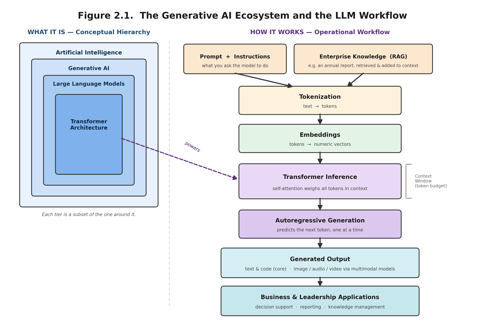

# AIML-505: Large Language Models and Generative Artificial Intelligence

Graduate course materials, interactive Jupyter notebooks, and enterprise AI resources for AIML-505.

---

## Course Overview

This repository contains the instructional materials for **AIML-505: Large Language Models and Generative Artificial Intelligence**. The course integrates theoretical foundations with hands-on Python programming, interactive Jupyter notebooks, enterprise case studies, and practical applications of Generative Artificial Intelligence.

Students explore how Large Language Models (LLMs) support business leadership, organizational decision-making, knowledge management, and enterprise AI applications through authentic business documents and interactive demonstrations.

---

## Learning Objectives

Upon successful completion of this course, students will be able to:

- Explain the foundations of Artificial Intelligence and Generative Artificial Intelligence.
- Describe the architecture and capabilities of Large Language Models.
- Apply prompt engineering techniques for enterprise AI applications.
- Analyze unstructured business documents using Python.
- Explain tokenization, context windows, and transformer architectures.
- Develop Retrieval-Augmented Generation (RAG) workflows.
- Evaluate responsible and ethical AI practices.
- Apply Generative AI to business leadership and strategic decision-making.

---

## Course Structure

| Workshop | Topic | Status |
|-----------|----------------------------------------------|----------------|
| Workshop 1 | Foundations of Generative AI | Completed |
| Workshop 2 | Prompt Engineering | In Development |
| Workshop 3 | Enterprise AI Applications | In Development |
| Workshop 4 | Retrieval-Augmented Generation (RAG) | In Development |
| Workshop 5 | AI Agents and Enterprise Workflows | In Development |
| Workshop 6 | Enterprise AI Capstone Project | In Development |

---

## Repository Structure

```text
AIML-505-Generative-AI/
│
├── Microsoft-Enterprise-Knowledge-Repository/
│   ├── datasets/
│   ├── images/
│   └── resources/
│
├── Workshop-01/
├── Workshop-02/
├── Workshop-03/
├── Workshop-04/
├── Workshop-05/
└── Workshop-06/
```

---

## Microsoft Enterprise Knowledge Repository

This repository includes publicly available Microsoft corporate documents used throughout the course as an enterprise case study.

Primary resources include:

- Microsoft Annual Report
- Microsoft Form 10-K
- Microsoft Shareholder Letter
- Additional Microsoft documentation

These documents support demonstrations involving:

- Enterprise document analysis
- Prompt engineering
- Text summarization
- Information extraction
- Retrieval-Augmented Generation (RAG)
- Business decision support

---

## Workshop Preview

### Figure 2.1. The Generative AI Ecosystem and the LLM Workflow



---

## Software and Technologies

- Python
- Jupyter Notebook
- pandas
- NumPy
- Matplotlib
- python-docx
- IPython

Additional libraries and enterprise AI frameworks will be introduced throughout the course.

---

## Repository Status

**Current Version:** 1.0

Workshop 1 has been completed. Additional workshops and enterprise AI case studies will be added throughout the course.

---

## License

This project is distributed under the MIT License.

---

## Instructor

**Dr. Eskinder Belete**

Indiana Wesleyan University

Graduate Program

Course: AIML-505 – Large Language Models and Generative Artificial Intelligence

---

## Acknowledgments

The Microsoft enterprise documents included in this repository are publicly available corporate publications and are provided solely for educational purposes. All trademarks, service marks, and copyrights remain the property of their respective owners.
