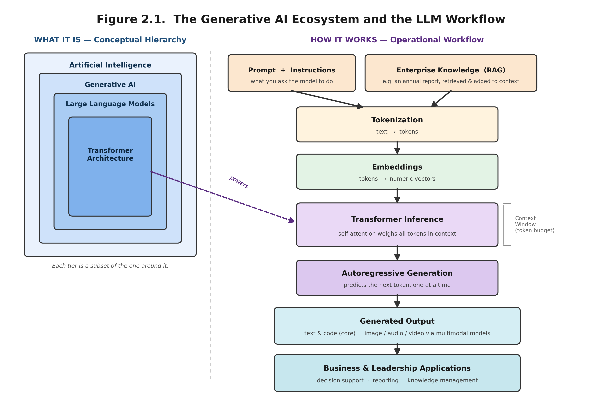

# AIML-505: Large Language Models and Generative Artificial Intelligence

Graduate course materials, interactive Jupyter notebooks, enterprise AI resources, and executive AI consulting materials for AIML-505.

---

## Course Overview

This repository contains the instructional materials for **AIML-505: Large Language Models and Generative Artificial Intelligence** at Indiana Wesleyan University. The course integrates theoretical foundations with interactive Jupyter notebooks, practical Python demonstrations, enterprise case studies, executive AI consulting resources, and applied Generative AI leadership exercises.

Students explore how Large Language Models (LLMs) support business leadership, organizational decision-making, enterprise knowledge management, cybersecurity, responsible AI, AI governance, and strategic AI transformation through authentic business documents, interactive demonstrations, executive consulting frameworks, and applied programming exercises.

A distinguishing feature of this course is the use of a continuous Microsoft enterprise case study. Throughout the workshops and residency experience, students analyze publicly available Microsoft corporate publications to examine how Artificial Intelligence supports enterprise strategy, governance, cybersecurity, responsible leadership, and digital transformation.

---

## Learning Objectives

Upon successful completion of this course, students will be able to:

- Explain the foundations of Artificial Intelligence and Generative Artificial Intelligence.
- Describe the architecture and capabilities of Large Language Models.
- Apply prompt engineering techniques for enterprise AI applications.
- Analyze unstructured business documents using Python.
- Explain tokenization, context windows, and transformer architectures.
- Develop Retrieval-Augmented Generation (RAG) workflows.
- Evaluate AI security, privacy, governance, and responsible AI practices.
- Apply Generative AI to business leadership and strategic decision-making.
- Develop enterprise AI transformation strategies using executive consulting methodologies.
- Evaluate organizational readiness for responsible and sustainable AI adoption.

---

## Course Structure

| Workshop | Topic | Status |
|-----------|--------------------------------------------------------------------------|-----------|
| Workshop 1 | Foundations of Generative Artificial Intelligence |  Completed |
| Workshop 2 | Prompt Engineering for Enterprise AI |  Completed |
| Workshop 3 | Enterprise AI Applications and Retrieval-Augmented Generation |  Completed |
| Workshop 4 | AI Security, Privacy, and Responsible AI Leadership |  Completed |
| Workshop 5 | Ethical AI Leadership and Strategic Decision-Making |  Completed |
| Workshop 6 | Enterprise AI Capstone Project |  In Development |

---

## Repository Structure

```text
AIML-505-Generative-AI/
│
├── Microsoft-Enterprise-Knowledge-Repository/
│   ├── datasets/
│   ├── images/
│   └── resources/
│
├── Workshop-01/
├── Workshop-02/
├── Workshop-03/
├── Workshop-04/
├── Workshop-05/
├── Workshop-06/
│
├── AIML-505 Residency-Executive AI Consulting/
│   ├── AIML-505_Executive_AI_Transformation_Proposal_Template.pdf
│   └── AIML-505_Executive_AI_Transformation_Proposal_Sample_Consulting_Report.pdf
│
├── CHANGELOG.md
├── LICENSE
├── README.md
├── requirements.txt
└── environment.yml
```

Each workshop contains lecture materials, supplementary Jupyter notebooks, interactive Python demonstrations, figures, datasets, and supporting instructional resources.

---

## Microsoft Enterprise Knowledge Repository

The Microsoft Enterprise Knowledge Repository serves as the primary enterprise case study throughout the course. Students use authentic Microsoft corporate publications to investigate how Generative AI is applied within a global technology organization.

Primary resources include:

- Microsoft Annual Report
- Microsoft Form 10-K
- Microsoft Shareholder Letter
- Supporting Microsoft documentation

These resources support activities such as:

- Enterprise document analysis
- Prompt engineering
- Information extraction
- Text summarization
- Retrieval-Augmented Generation (RAG)
- AI security and governance
- Business decision support
- Executive AI consulting

---

## AIML-505 Residency: Executive AI Consulting

The residency component extends the workshop experience through an executive consulting engagement in which student teams evaluate a real organization and develop an **Executive AI Transformation Proposal**.

Students apply concepts learned throughout the course—including enterprise AI strategy, responsible AI, cybersecurity, governance, AI assistants, organizational change, and executive leadership—to produce a professional consulting report suitable for presentation to executive leadership.

Residency resources include:

- Executive AI Transformation Proposal Template
- Executive AI Transformation Proposal Sample Consulting Report
- Enterprise AI consulting framework
- AI governance and transformation planning resources
- Executive presentation guidance

The Microsoft sample proposal demonstrates how publicly available corporate information can be used to evaluate organizational readiness, identify AI opportunities, design an enterprise AI transformation strategy, assess risks, establish responsible AI governance, and formulate executive recommendations.

---

## Repository Highlights

This repository includes:

- Interactive Jupyter Notebooks for each workshop
- Practical Python demonstrations supporting Generative AI concepts
- Microsoft Enterprise Knowledge Repository
- Enterprise AI case studies
- Prompt Engineering and Retrieval-Augmented Generation (RAG)
- AI Security, Privacy, and Responsible AI resources
- Ethical AI Leadership and Strategic Decision-Making frameworks
- Executive AI Consulting Residency materials
- Executive AI Transformation Proposal Template
- Sample Executive Consulting Report
- Enterprise leadership and AI governance resources

---

## Workshop Preview

### Figure 2.1. The Generative AI Ecosystem and the LLM Workflow



---

## Software and Technologies

The course uses the following technologies throughout the workshops and residency activities:

- Python
- Jupyter Notebook
- pandas
- NumPy
- Matplotlib
- python-docx
- IPython
- Markdown
- HTML
- Git & GitHub

Additional AI frameworks, enterprise development tools, cloud technologies, and Generative AI platforms are introduced throughout the course where appropriate.

---

## Repository Status

**Current Version:** **1.5**

### Completed

- ✅ Workshop 1
- ✅ Workshop 2
- ✅ Workshop 3
- ✅ Workshop 4
- ✅ Workshop 5
- ✅ AIML-505 Residency Executive AI Consulting Resources

### In Development

- 🚧 Workshop 6 – Enterprise AI Capstone Project

The repository is continuously updated with additional instructional materials, interactive notebooks, enterprise case studies, and executive AI consulting resources.

---

## License

This project is distributed under the **MIT License**.

---

## Instructor

**Dr. Eskinder Belete**

Adjunct Faculty

Indiana Wesleyan University

Graduate Program

**Course:** AIML-505 – Large Language Models and Generative Artificial Intelligence

---

## Acknowledgments

The Microsoft corporate documents included in this repository are publicly available publications and are provided solely for educational purposes. Microsoft and related trademarks are the property of Microsoft Corporation. All other trademarks, copyrights, and intellectual property remain the property of their respective owners.
